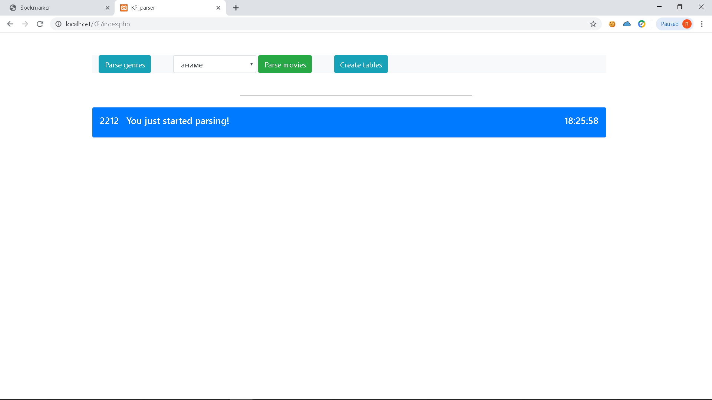
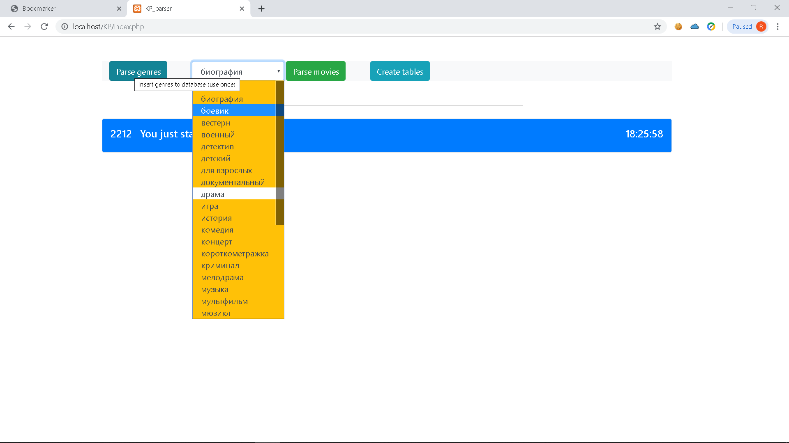

# KinopoislParser
Данный парсер работает на selenium Он заносит в БД основную информацию о фильмах (kinopoisk_id,название,год,рейтинг).
Важно - дабы не перегружать БД парсер не берет фильмы без постера, т.к. они практически не нужны.

Для начала вам нужно будет установить окружающую среду для его запуска, для этого потебуется:

1.Selenium-standalone-server(https://www.seleniumhq.org/download/).

2.ChromeDriver(https://chromedriver.chromium.org/downloads).

3.Создать БД - импортировайть файл kinopoisk.sql.

Перед запуском парсера убедитесь что вы запустили селениум сервер.
Изначально вам нужно нажать на "Parse genres" - спарсит все имеющиеся на данный момент жанры с кинопоиска и поместит их в таблицу genres. 
Если это пройзошло успешно вам нужно нажать на "Create tables" - создаст в БД таблицу под каждый жанр.

После чего можно приступать к парсингу. Для начала выберите жанр и нажимайте "Parse movies"(Жанры которые уже спарсились помечены желтым цветом,
кторые нет - белым.)

Далее парсер зайдет на страницу с выбраным жанром и узнаел кол-во страниц

Первым делом он проверит нет ли записи по этому жанру в таблице save (Если во время парсинга что-то пошло не так, или вы остановили парсер
то он записывает туда страницу на которой остановился), и если находит запись то начинает с указанной страницы .

В данном случае он запомнил что парсинг остановился на 120 странице, и начал с нее. 
Во время парсинга он заносит логи в таблицу logs и отображает на экране (их можно скрыть и отобразить нажав на "Show/hide logs".

